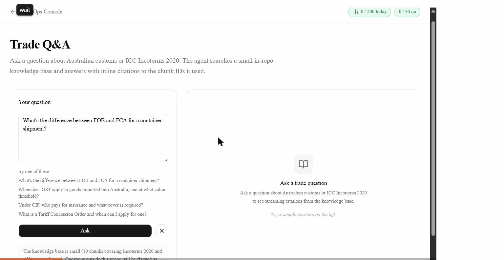

# TradeOps Console

Four AI agents for a trade ops desk. Reasoning streams token by token; tool calls render as cards as they happen.

Live: [tradeops-console.vercel.app](https://tradeops-console.vercel.app)



## Problem

Trade ops desks lose hours per day to email triage, invoice entry, sanctions checks, and customs lookups. This is what an AI version of that desk looks like.

## Try it

- [Invoice Extractor](https://tradeops-console.vercel.app/agents/invoice-extractor): drop a supplier PDF, get structured line items.
- [Inbox Triager](https://tradeops-console.vercel.app/agents/inbox-triager): paste a trade email, get a category plus a drafted reply.
- [Compliance Pre-Check](https://tradeops-console.vercel.app/agents/compliance): type a counterparty name, get a sanctions verdict.
- [Trade Q&A](https://tradeops-console.vercel.app/agents/qa): ask about Incoterms or Australian customs, get an answer with inline citations.

## What it does

| Agent | Input | Output | Tool used |
|---|---|---|---|
| Invoice Extractor | Supplier PDF | Structured JSON line items with confidence scores | `extract_line_items` |
| Inbox Triager | Trade-desk email | Category (RFQ, order, complaint, spam, info) plus a drafted reply | `classify_email`, `draft_reply` |
| Compliance Pre-Check | Counterparty name | Sanctions verdict with cited reasoning | `check_sanctions` |
| Trade Q&A | Customs or Incoterms question | Answer with inline citations to an in-repo knowledge base | `search_corpus` |

## Engineering highlights

The agents are the product; the substrate underneath is the engineering.

- **Edge protection.** Per-IP rate limit (5/min, 30/day, per agent) plus a global daily budget, all backed by Vercel KV. Fails open on KV unreachable so the user request is never blocked by a counter outage. See [`src/middleware.ts`](src/middleware.ts) and [`src/lib/rate-limit.ts`](src/lib/rate-limit.ts).
- **Full observability.** One structured JSON line per event, shipped to Axiom in the background after the stdout write. Trace IDs propagate from the edge through the route into the UI's error cards. PII (emails, phones, IPv4) is redacted before logs leave the process. See [`src/lib/log.ts`](src/lib/log.ts), [`src/lib/axiom.ts`](src/lib/axiom.ts), and [PR #80](https://github.com/ShreePatil19/tradeops-console/pull/80).
- **Response cache, two flavours.** Text-only replay for `qa` / `inbox` / `compliance` ([PR #81](https://github.com/ShreePatil19/tradeops-console/pull/81)). Full UI-message-stream replay for `invoice` so the `extract_line_items` tool card survives cache hits ([PR #86](https://github.com/ShreePatil19/tradeops-console/pull/86)). Both use SHA-256 input hashing and a 1-hour TTL.
- **Deterministic eval fixtures.** Five PDFs covering clean, partial, stamped, handwritten, and multi-page variants, generated by [`evals/invoice/fixtures/build.ts`](evals/invoice/fixtures/build.ts) and byte-equal across CI runs (creation date pinned, `useObjectStreams: false`). `pnpm fixtures:invoice -- --check` enforces no drift.
- **Strict type safety.** Zod input schema on every tool. Strict TypeScript with no `any` in application code. `tsc --noEmit` runs on every PR.
- **CI gate.** Four required status checks on `main` (Type check, Lint, Build, Unit tests). Linear history enforced, no force pushes, strict-mode merges. The merge gate is real, not self-disciplined.
- **Tests.** 327 across 28 files. Every PR commits at least one test alongside the change. Mocks are scoped per-file via `vi.hoisted`; nothing touches the live model from CI.
- **ADRs.** Five architecture decision records under [`docs/adr/`](docs/adr/) covering model choice, KV vs sticky-session rate limiting, the eval framework, and the observability sink.

## Architecture

```
Browser
  -> Edge middleware (rate limit, budget, trace ID)
  -> Next.js API route handler
  -> AI SDK streamText
  -> Gemini 2.5 Flash
  -> Vercel KV (rate counters, response cache)
  -> Axiom (structured event log)
```

Worked example: [docs/superpowers/plans/2026-05-25-edge-protection.md](docs/superpowers/plans/2026-05-25-edge-protection.md)

## Stack

- Next.js 16 (App Router, TypeScript)
- Tailwind v4, shadcn/ui
- AI SDK v6, Google Gemini 2.5 Flash
- Vercel KV
- Deployed on Vercel

## Run locally

```sh
pnpm install
pnpm dev
```

Open http://localhost:3000. Without env vars, rate-limit / budget / cache fail open silently and only the model call needs the key.

### Environment

| Var | Required | Default | Purpose |
|---|---|---|---|
| `GOOGLE_GENERATIVE_AI_API_KEY` | yes for model calls | unset | Free key at [aistudio.google.com/apikey](https://aistudio.google.com/apikey). |
| `DAILY_BUDGET` | no | `200` | Global per-day request cap. Returned as `cap` on `/api/budget`. |
| `KV_REST_API_URL`, `KV_REST_API_TOKEN` | for prod KV | unset | Auto-injected when a Vercel KV instance is connected to the project. Without them, rate limiting, budget, and response cache fail open. |
| `AXIOM_TOKEN`, `AXIOM_DATASET` | optional | unset | When both set, every sanitised log event is shipped via fire-and-forget HTTP POST. Without them, logs only land in Vercel's built-in viewer. |
| `AXIOM_HOST` | optional | `api.axiom.co` | Override for regional Axiom routing (e.g. `api.axiom.eu`). |

Push every env var to all three Vercel environments in one command:

```sh
pnpm env:sync --file=.env.local                 # all 3 envs
pnpm env:sync --file=.env.local --env=production
pnpm env:sync --file=.env.local --dry-run       # preview without writing
```

## Run evals

```sh
pnpm eval                                            # all agents, local API
pnpm eval --agent invoice                            # one agent
pnpm eval --base-url https://tradeops-console.vercel.app  # against production
```

Real PDF fixtures for the invoice agent are committed under `evals/invoice/fixtures/`. Regenerate them with `pnpm fixtures:invoice` (deterministic).

## Deploy

Push to `main`. Vercel auto-deploys via the GitHub integration. Branch protection on `main` requires all four CI checks to pass before merge, so a red PR cannot deploy.

## Project log

Continuous record of every shipped feature, every merged PR, and every architectural decision lives in [`docs/ACTIONS.md`](docs/ACTIONS.md). Updated inside every PR; never out of sync with the repo.
